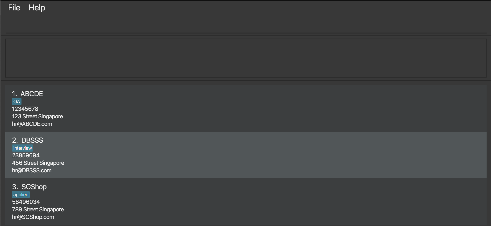
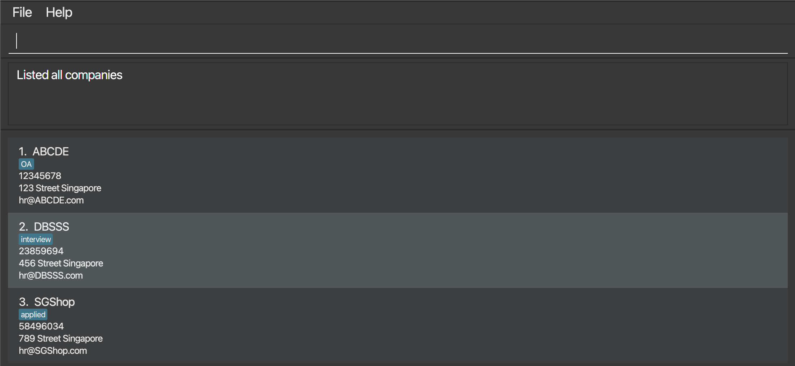
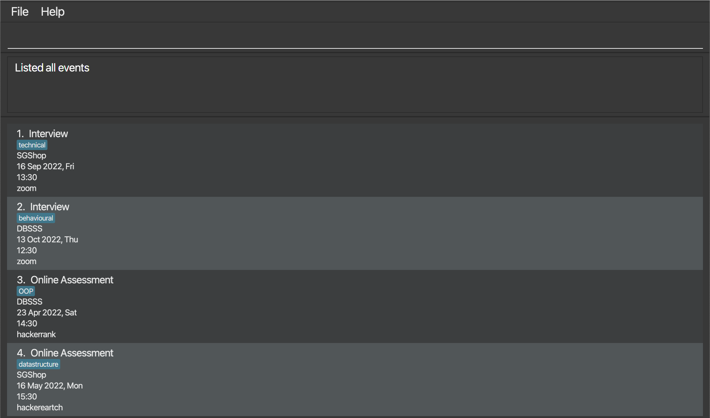

InternBuddy is a **desktop app to help computer science students manage the events, companies, and contact people encountered during the internship search. The app is optimized for use via a Command Line Interface (CLI) while still having the benefits of a Graphical User Interface (GUI).** If you can type fast, InternBuddy can help you organize your internship search faster than traditional GUI apps.

The purpose of this User Guide is to assist you in learning and using InternBuddy. Whether you're a new user looking for a place to start or a veteran needing a quick reference, this guide is here to answer your questions.

* Table of Contents
{:toc}

--------------------------------------------------------------------------------------------------------------------

## Quick start
If you feel InternBuddy is the solution to your problem and you're interested in using it, try it out now! If this is your first time using InternBuddy, you can get started right away by following the steps below.
1. Ensure you have Java `11` or above installed in your Computer.
   * If you don't have it installed, you can follow [Orcale's JDK installation guide](https://docs.oracle.com/en/java/javase/11/install/installation-guide.pdf)
   for your operating system.
   * Please make sure that you select Java `11` as your default Java version.
   * If you are not sure which version of Java that you currently have, you can follow [Java Manual](https://www.java.com/en/download/help/version_manual.html)
   to check.

2. Download the latest `InternBuddy.jar` from [here](https://github.com/AY2122S2-CS2103T-W14-3/tp/releases/tag/v1.2.0).

3. Copy the file to the folder you want to use as the _home folder_ for InternBuddy.

4. Double-click the file to start the app. A window similar to the one below should appear in a few seconds. Note how the app contains some sample data.<br>
   

5. Type the command in the command box and press Enter to execute it. e.g. typing **`help`** and pressing Enter will open the help window.<br>
   Some example commands you can try:

   * **`listc`** : Lists all companies.

   * **`addc`**`n/DeeBee p/98765432 e/dbs@example.com a/14 Jurong Street #01-01` : Adds a company named `DeeBee` to the list of companies.

   * **`delete`**`3` : Deletes the 3rd contact shown in the current list.

   * **`clear`** : Deletes all entries.

   * **`exit`** : Exits the app.

6. If this is your first time reading our user guide, you can refer to our [Guide Walkthrough](#guide-walkthrough) section to learn how to navigate the guide, and eventually the app.

----
## Guide Walkthrough
If you're new, welcome to **InternBuddy**! We're trying to make this guide as easy to read as possible. We hope this section will help you read the guide and get started with InternBuddy.

### Overview of InternBuddy
InternBuddy is designed specifically for students who are searching for internships. With InternBuddy, there is no need for you to juggle between multiple apps just to manage your multiple internship applications. With efficiency as its focus, InternBuddy values your **Time** and **Experience**. Let InterBuddy help you to manage your application details so you can focus acing your assessments and interviews!
### Structure of InternBuddy
With internships and job seeking as our main focus, we are going over 3 main entries of InternBuddy:
- **Company**: A company will represent a  company that you are applying for, or will be applying for.
- **Person**: A person will represent a contact person. In can be used for general purpose of storing a contact person with a company related to it. The contact person may have a specific role such as the HR of a company.
- **Event**: An event will represent an event of a company. An event can be an online assessment, an interview, a job fair, etc.

And with that, InternBuddy stores 3 lists for 3 different types of entries:
- **[Companies](#company-list)**
- **[Persons](#person-list)**
- **[Events](#event-list)**

The app will only display one of these lists at any time, as shown in the screenshot below. Each of these 3 different types have different attributes attached to them. Let's dive in to understand what each type can store.

#### Company List


A Company entry has:
* A *name*
* An *email address*
* A *phone number*
* A *real-life address*
* Zero or more *tags* associated with them

#### Person List


A Person entry has:
* A *name*
* The *name* of the Company the Person is associated with
* An *email address*
* A *phone number*
* Zero or more *tags* associated with them

#### Event List


Finally, an Event entry has:
* A *name*
* The *name* of the Company the Event is associated with
* A *date*
* A *time*
* A *location*
* Zero or more *tags* associated with them

### Interacting with the app
Since **InternBuddy** is designed to be used via a Command Line Interface (CLI), you will be interacting with the app mostly through typing the commands. To interact with these app, you **type commands into the command box** and **hit the Enter key** when you are done.<br/>
**InternBuddy**'s commands follows a simple classification system for all 3 lists. There are 5 types of commands:
- **Adding entries**
  - [`addc`](#adding-a-company-addc): Adds a company to the list of companies.
  - [`addp`](#adding-a-person-addp): Adds a person to the list of persons.
  - [`adde`](#adding-an-event-adde): Adds an event to the list of events.
- **Listing/Viewing entries**
  - [`listc`](#listing-all-companies--listc): Lists all companies.
  - [`listp`](#listing-all-persons--listp): Lists all persons.
  - [`liste`](#listing-all-events--liste): Lists all events.
- **Editing entries**
  - [`editc`](#editing-a-company--editc): Edits a company.
  - [`editp`](#editing-a-person--editp): Edits a person.
  - [`edite`](#editing-an-event--edite): Edits an event.
- **Deleting entries**
  - [`delete`](#deleting-an-entry--delete): Deletes an entry. 
- **Finding/Locating entries**
  - [`findc`](#locating-companies-findc): Finds a company.
  - [`findp`](#locating-people-by-name-findp): Finds a person.
  - [`finde`](#locating-events-finde): Finds an event. 

There are other commands such as [`help`](#viewing-help--help), [`clear`](#clearing-all-entries--clear), and [`exit`](#exiting-the-program--exit). You can try clicking on the commands above to see how to use them in further details. However, we would suggest you to read the [User Guide Icons](#user-guide-icons) and [Command Formats](#command-formats) section first to have a smoother experience reading our [Features](#features) section :smile:.

#### Dialog Box
For those of you not familiar with what a dialog box is, a dialog box is a box that shows when you execute a command. It is a box that contains a message. The message is basically a feedback from InternBuddy to you. InternBuddy will show you a dialog box when you execute a command.

If the command you tried to execute is **invalid** for whatever reason, an **error message** will be shown and the command you typed will remain. An example of this is shown below.


Otherwise, if the command is **valid**, a **success message** will be shown and the command will be executed. The command box will also be cleared.


### User Guide Icons

| Icon               | Meaning                                                       |
|--------------------|---------------------------------------------------------------|
|:information_source:| This icon indicates important information to be taken note of |
|:bulb:               | This icon indicates useful tips for the users                |

### Command Formats
With a simple command standards, we tried to make the commands as intuitive as possible. To make sure that you can read the commands without any confusion, here are the formats we use in the guide.
<div markdown="block" class="alert alert-info">

**:information_source: Notes about the command format:**<br>

* Words in `UPPER_CASE` are the parameters to be supplied by the user.<br>
  e.g. in `add n/NAME`, `NAME` is a parameter which can be used as `add n/John Doe`.

* Items in square brackets are optional.<br>
  e.g `n/NAME [t/TAG]` can be used as `n/John Doe t/friend` or as `n/John Doe`.

* Items with `…`​ after them can be used multiple times including zero times.<br>
  e.g. `[t/TAG]…​` can be used as ` ` (i.e. 0 times), `t/friend`, `t/friend t/family` etc.

* Parameters can be in any order.<br>
  e.g. if the command specifies `n/NAME p/PHONE_NUMBER`, `p/PHONE_NUMBER n/NAME` is also acceptable.

* If a parameter is expected only once in the command but you specified it multiple times, only the last occurrence of the parameter will be taken.<br>
  e.g. if you specify `p/12341234 p/56785678`, only `p/56785678` will be taken.

* Extraneous parameters for commands that do not take in parameters (such as `help`, `list`, `exit` and `clear`) will be ignored.<br>
  e.g. if the command specifies `help 123`, it will be interpreted as `help`.

</div>

### Finishing Up
And that's all there is to it! Now that you have a basic understanding of the commands, You can now get started on learning all the important [commands](#features) you can use to organize your InternBuddy lists. Focus on that interview and get that internship! If you have any trouble, do refer back to the user guide and the [FAQ](#faq) section. Good luck! :confetti_ball: :confetti_ball: :confetti_ball:

--------------------------------------------------------------------------------------------------------------------

## Features
Our InternBuddy has a number of features that you can use to organize your InternBuddy lists. These features follows a certain command format. If you haven't read it, please refer to the [User Guide Icons](#user-guide-icons) and [Command Formats](#command-formats) section first. If you are still confused, please refer to the [FAQ](#faq) section. Otherwise, you can start using the features listed below. :smile:

<div markdown="span" class="alert alert-primary">:bulb: **Tip:**
Read the <a href="#glossary">Glossary</a> section to find some uncommon or niche words in the user guide.
</div>

### Getting help
#### Viewing help : `help`

Shows a message explaning how to access the help page.


Format:
```
help
```

### Adding entries
#### Adding a company: `addc`

Adds a company to the list of companies.

Format: 
```
addc n/NAME p/PHONE_NUMBER e/EMAIL a/ADDRESS [t/TAG]…​
```

<div markdown="span" class="alert alert-primary">:bulb: **Tip:**
Entries can have any number of tags (including 0)
</div>

Examples:
* `addc n/Shopee p/96113432 e/shopee@gmail.com a/14 Jurong Street #01-01`
* `addc n/DBS t/bank e/dbs@protonmail.com p/1234567 a/31 Race Card Road #02-03 t/financial`

#### Adding a person: `addp`

Adds a person to the list of contact people.

Format: 
```
addp n/NAME c/COMPANY_NAME p/PHONE_NUMBER e/EMAIL [t/TAG]…​
```

<div markdown="span" class="alert alert-warning">:grey_exclamation: **Note:**
`COMPANY_NAME` must match the name of an existing Company in the Company list.
</div>

Examples:
* `addp n/John Doe c/Shopee p/98765432 e/johnd@example.com`
* `addp n/Betsy Crowe c/DBS t/friend e/betsycrowe@example.com p/1234567 t/criminal`

#### Adding an event: `adde`

Adds an event to the list of events.

Format: 
```
adde n/NAME c/COMPANY_NAME d/DATE ti/TIME l/LOCATION [t/TAG]…​
```

<div markdown="span" class="alert alert-warning">:grey_exclamation: **Note:**
`DATE` must be in the format YYYY-MM-DD, while `TIME` must be in the format HH:MM.
E.g. 2022-10-20 and 13:30.
</div>

<div markdown="span" class="alert alert-warning">:grey_exclamation: **Note:**
`COMPANY_NAME` must match the name of an existing Company in the Company list.
</div>

Examples:
* `adde n/Interview c/DBS d/2022-04-02 ti/14:00 l/Zoom`
* `adde n/Career Talk ti/10:00 d/2022-03-19 c/Sony t/important l/22 Clementi Rd`
### Listing entries
#### Listing all companies : `listc`

Shows a list of all companies in the list of companies.

Format:
```
listc
```

#### Listing all persons : `listp`

Shows a list of all people in the list of contact people.

Format: 
```
listp
```

### Listing all events : `liste`

Shows a list of all events in the list of events.

Format: 
```
liste
```

### Editing entries
<div markdown="block" class="alert alert-info">

**:information_source: Notes about the Edit Commands:**<br>

* Each edit command identifies the entry to edit based on the `INDEX`.
* The index refers to the index number shown in the appropriately displayed list. For example, for the `editp` command, the index refers to the index in the displayed person list.
* The index **must be a positive integer** 1, 2, 3,...
* At least one parameter aside from `INDEX` must be provided.
* For the parameters not included in the edit command, the values stored for those parameters will remain the same.
* When editing tags, the existing tags of the entry will be removed i.e adding of tags is not cumulative.

</div>

#### Editing a company : `editc`

Edits an existing company in the list of companies.

Format: 
```
editc INDEX [n/NAME] [p/PHONE] [e/EMAIL] [a/ADDRESS] [t/TAG]…
```

<div markdown="span" class="alert alert-warning">:grey_exclamation: **Note:**
If the name of the Company is edited, all Events and Persons referring to the Company will also
update the company name they have stored.
</div>

Examples:
* `editc 1 p/91234567 e/company@example.com` Edits the phone number and email address of the 1st company to be `91234567` and `company@example.com` respectively.
* `editc 2 n/Shoppee t/` Edits the name of the 2nd company to be `Shoppee` and clears all existing tags.

#### Editing a person : `editp`

<div markdown="span" class="alert alert-primary">:bulb: **Tip:**
You can remove all of an entry’s tags by typing `t/` without specifying any tags after it.
</div>

Edits an existing person in the list of contact people.

Format: 
```
editp INDEX [n/NAME] [c/COMPANY_NAME] [p/PHONE] [e/EMAIL] [t/TAG]…​
```

<div markdown="span" class="alert alert-warning">:grey_exclamation: **Note:**
`COMPANY_NAME` must match the name of an existing Company in the Company list.
</div>

Examples:
*  `editp 1 p/91234567 e/johndoe@example.com` Edits the phone number and email address of the 1st person to be `91234567` and `johndoe@example.com` respectively.
*  `editp 2 n/Betsy Crower t/` Edits the name of the 2nd person to be `Betsy Crower` and clears all existing tags.

#### Editing an event : `edite`

Edits an existing event in the list of events.

Format: 
```
edite INDEX [n/NAME] [c/COMPANY_NAME] [d/DATE] [ti/TIME] [l/LOCATION] [t/TAG]…
```

<div markdown="span" class="alert alert-warning">:grey_exclamation: **Note:**
`DATE` must be in the format YYYY-MM-DD, while `TIME` must be in the format HH:MM.
E.g. 2022-10-20 and 13:30.
</div>

<div markdown="span" class="alert alert-warning">:grey_exclamation: **Note:**
`COMPANY_NAME` must match the name of an existing Company in the Company list.
</div>

Examples:
* `edite 1 d/2021-12-21 l/Zoom` Edits the date and location of the 1st event to be `2021-12-21` and `Zoom` respectively.
* `edite 2 n/Resume Screening t/` Edits the name of the 2nd event to be `Resume Screening` and clears all existing tags.
### Locating entries
#### Locating companies: `findc`

**TODO**

#### Locating people by name: `findp`

Finds people whose names contain any of the given keywords.

Format: 
```
findp KEYWORD [MORE_KEYWORDS]
```

* The search is case-insensitive. e.g `hans` will match `Hans`
* The order of the keywords does not matter. e.g. `Hans Bo` will match `Bo Hans`
* Only the name is searched.
* Only full words will be matched e.g. `Han` will not match `Hans`
* Persons matching at least one keyword will be returned (i.e. `OR` search).
  e.g. `Hans Bo` will return `Hans Gruber`, `Bo Yang`

Examples:
* `find John` returns `john` and `John Doe`
* `find alex david` returns `Alex Yeoh`, `David Li`<br>
  

#### Locating events: `finde`

**TODO**

### Removing entries
#### Deleting an entry : `delete`

Deletes the specified entry from the currently displayed list.

Format: 
```
delete INDEX
```

* Deletes the entry at the specified `INDEX` of the currently displayed list.
* The index refers to the index number shown in the currently displayed list.
* The index **must be a positive integer** 1, 2, 3, …​

Examples:
* `listc` followed by `delete 2` deletes the 2nd company in the list of comapnies.
* `findp Betsy` followed by `delete 1` deletes the 1st person in the results of the `find` command.

#### Clearing all entries : `clear`

Clears all entries from all lists.

Format: `clear`

### Exiting the program : `exit`

Exits the program.

Format: `exit`

### Saving the data

InternBuddy data are saved in the hard disk automatically after any command that changes the data. There is no need to save manually.

### Editing the data file [FOR ADVANCED USERS]

InternBuddy data are saved as a JSON file `[JAR file location]/data/internbuddy.json`. Advanced users are welcome to update data directly by editing that data file.

<div markdown="span" class="alert alert-warning">:exclamation: **Caution:**
If your changes to the data file makes its format invalid, InternBuddy will discard all data and start with an empty data file at the next run.
</div>

--------------------------------------------------------------------------------------------------------------------

## Common Workflow

**TODO**

--------------------------------------------------------------------------------------------------------------------

## FAQ

**Q**: How do I transfer my data to another Computer?<br>
**A**: Install the app in the other computer and overwrite the empty data file it creates with the file that contains the data of your previous InternBuddy home folder.


--------------------------------------------------------------------------------------------------------------------

## Glossary

**TODO**

--------------------------------------------------------------------------------------------------------------------

## Command summary

| Action             | Format                                                                           | Examples                                                                             |
|--------------------|----------------------------------------------------------------------------------|--------------------------------------------------------------------------------------|
| **Add Person**     | `addp n/NAME c/COMPANY_NAME p/PHONE_NUMBER e/EMAIL [t/TAG]… `                    | `addp n/John Doe c/Shopee p/98765432 e/johnd@example.com t\friend t\colleague`       |
| **Add Company**    | `addc n/NAME p/PHONE_NUMBER e/EMAIL a/ADDRESS [t/TAG]… `                         | `addc n/DBS t/bank e/dbs@protonmail.com p/1234567 a/31 Race Card R #02-03 t/finance` |
| **Add Event**      | `adde n/NAME c/COMPANY_NAME d/DATE ti/TIME l/LOCATION [t/TAG]… `                 | `adde n/Career Talk c/Sony d/2022-03-19 ti/10:00 l/22 Clementi Rd t/important`       |
| **Clear**          | `clear`                                                                          |                                                                                      |
| **Delete**         | `delete INDEX`                                                                   | `delete 3`                                                                           |
| **Edit Person**    | `editp INDEX [n/NAME] [c/COMPANY_NAME] [p/PHONE] [e/EMAIL] [t/TAG]…`             | `editp 1 p/91234567 e/johndoe@example.com`                                           |
| **Edit Company**   | `editc INDEX [n/NAME] [p/PHONE] [e/EMAIL] [a/ADDRESS] [t/TAG]…`                  | `editc 2 n/Shoppee t/`                                                               |
| **Edit Event**     | `edite INDEX [n/NAME] [c/COMPANY_NAME] [d/DATE] [ti/TIME] [l/LOCATION] [t/TAG]…` | `edite 2 n/Resume Screening d/2022-12-11`                                              |
| **Find Person**    | `findp KEYWORD [MORE_KEYWORDS]`                                                  | `find James Jake`                                                                                     |
| **List Persons**   | `listp`                                                                          |                                                                                      |
| **List Companies** | `listc`                                                                          |                                                                                      |
| **List Events**    | `liste`                                                                          |                                                                                      |
| **Help**           | `help`                                                                           |                                                                                      |
